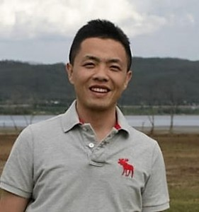

## About Me

Hi! I am currently a PhD student in Computer Engineering at University of Central Florida. I received my Master degree in Computer Science from Georgia State University at 2013  and Bachelor degree in Software Engineering from Harbin Institute of Technology in China at 2011.

## Research Interest

Approximate computing, Graph processing and Big data storage.

## Publications

1. Xuhong Zhang, Jun Wang, and Jiangling Yin. Sapprox: Enabling efficient and accurate approximations on sub-datasets with distribution-aware online sampling. Proc. VLDB Endow., 10(3), 2016.
2. Jun Wang, Jiangling Yin, Jian Zhou, Xuhong Zhang, and R. Wang. Datanet: A data distribution-aware method for sub-dataset analysis on distributed file systems. In 2016 IEEE International Parallel and Distributed Processing Symposium (IPDPS), pages 504–513, May 2016.
3. Jun Wang, Xuhong Zhang, Junyao Zhang, Jiangling Yin, Dezhi Han, Ruijun Wang, and Dan Huang. Deister: A light-weight autonomous block management in data-intensive file systems using deterministic declustering distribution. Journal of Parallel and Distributed Computing, 2016.
4. Xuhong Zhang, Ruijun Wang, Xunchao Chen, Jun Wang, Tyler Lukasiewicz, and Dezhi Han. Achieving up to zero communication delay in bsp-based graph processing via vertex categorization. In Networking, Architecture and Storage (NAS), 2015 IEEE International Conference on, pages 112–121. IEEE, 2015.
5. Xuhong Zhang, Yanqing Zhang, Jing He, and Frank Cobia. Vision-based web page block segmentation and informative block detection. In Web Intelligence (WI) and Intelligent Agent Technologies (IAT), 2013 IEEE/WIC/ACM International Joint Conferences on, volume 3, pages 265–269. IEEE, 2013.
